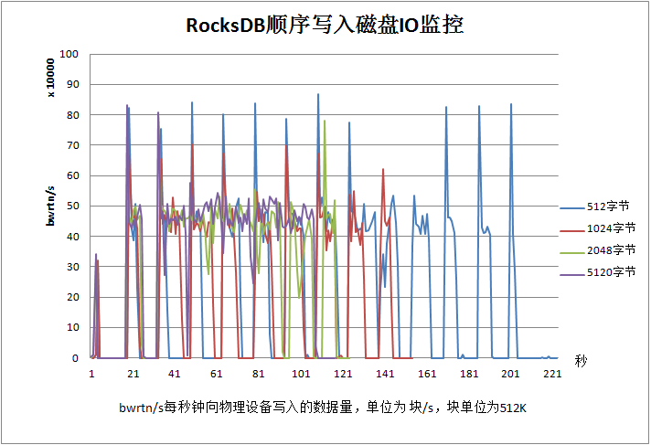
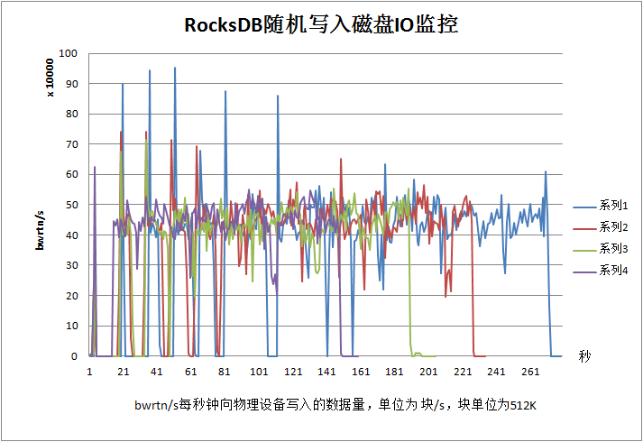
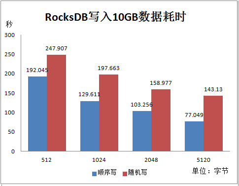
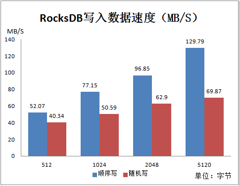
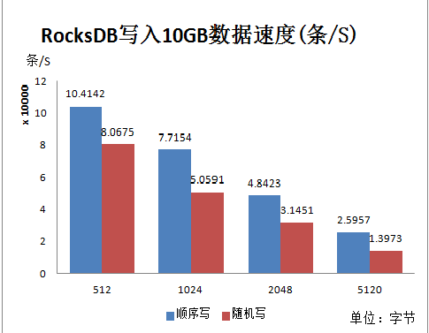
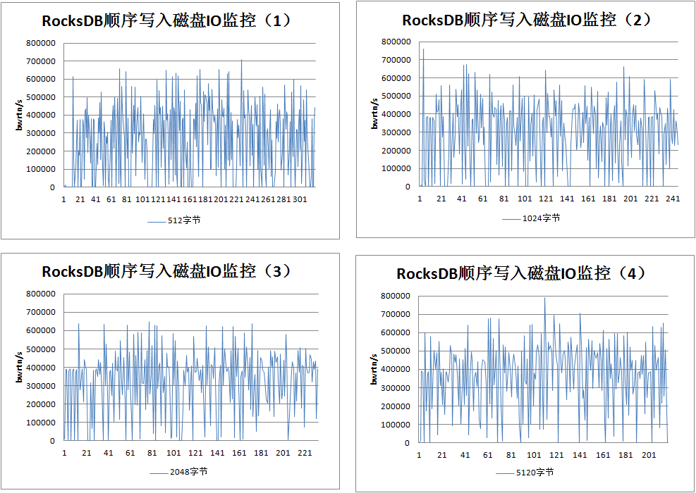
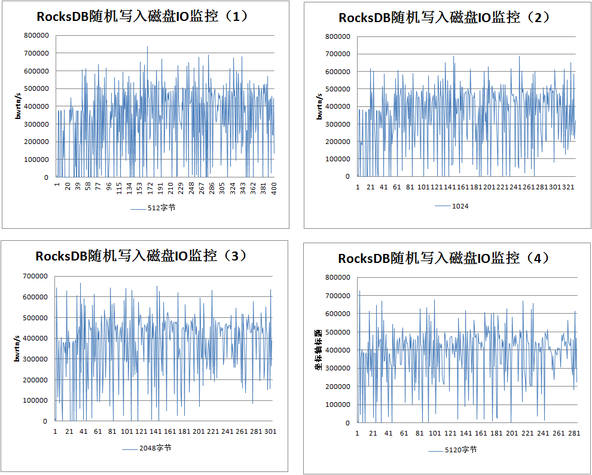
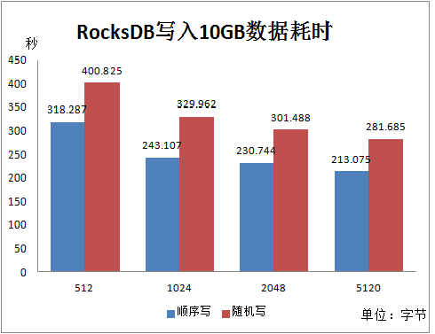
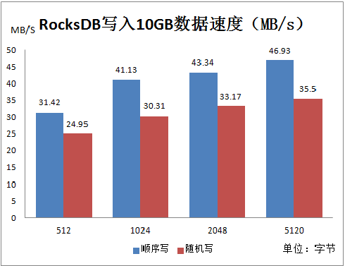
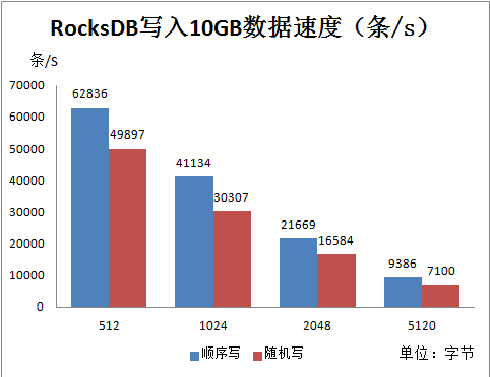

# RocksDB 性能测试

> 刘新春 2016年11月16日

## 1. 测试环境

使用软件包版本信息如下：    

| 软件名称        | 软件版本号        |
| ----------- | ------------ |
| scala       | scala-2.11.8 |
| java        | 1.8.0        |
| RocksDBJava | 4.11.2       |

平台信息：    

| 名称   | 配置                                       |
| ---- | ---------------------------------------- |
| OS   | SUSE11-SP3                               |
| 内存   | 200GB                                    |
| 磁盘   | 500GB                                    |
| CPU  | 40核, Intel(R) Xeon(R) CPU E5-2690 v2 @ 3.00GHz |

测试使用10GB数据，`key`值为连续的数字`1,2,3...N`，`value`为随机字符串，长度依次为`512, 1024, 2048, 5120`字节。写入方式分别为顺序写入和随机写入。

## 2. RocksDB配置参数及结果

### 2.1 SPINNING_DISK_OPTIMIZED

#### 2.1.1 配置参数

测试参数使用Flink内部使用RocksDB设置的参数SPINNING_DISK_OPTIMIZED，具体见https://ci.apache.org/projects/flink/flink-docs-master/api/java/org/apache/flink/contrib/streaming/state/PredefinedOptions.html

```java
val options = new Options
options.setCompactionStyle(CompactionStyle.LEVEL)
  .setCompressionType(CompressionType.SNAPPY_COMPRESSION)
  .setLevelCompactionDynamicLevelBytes(true)
  .setIncreaseParallelism(4)
  .setUseFsync(false)
  .setMaxOpenFiles(-1)
  .setCreateIfMissing(true)
  
val write_options = new WriteOptions
write_options.setSync(false)
```

#### 2.1.2 测试结果 

#### 2.1.2.1 数据写入磁盘IO监控

本数据使用`sar`监控所得，监控命令为`sar -b 1`


由图可见：
* 顺序写入磁盘：在信息长度为`512`和`1024`时，顺序写入数据，磁盘IO呈现波峰波谷现象，这是由于每当一个memtable满时才将数据刷入到磁盘，且数据量不大，磁盘有休息的时间。当信息长度达到`2048`和`5120`时，磁盘处于不停写入状态。

* 随机写入磁盘：随机写入时，磁盘基本处于不停写入状态，这是由于数据在文件中是按块存储的，要不断刷新相关块。

#### 2.1.2.2 速度和耗时
  
  
  
由图中可以看出，随机写的性能要低于顺序写性能，主要是由于随机写时刷新不同数据块的概率上升造成的。

### 2.2 SPINNING_DISK_OPTIMIZED_HIGH_MEM

#### 2.2.1 配置参数

测试参数使用Flink内部使用RocksDB设置的参数SPINNING_DISK_OPTIMIZED_HIGH_MEM，具体见https://ci.apache.org/projects/flink/flink-docs-master/api/java/org/apache/flink/contrib/streaming/state/PredefinedOptions.html

```java
val options = new Options()
options.setLevelCompactionDynamicLevelBytes(true)
   .setTargetFileSizeBase(256 * SizeUnit.MB)
   .setMaxBytesForLevelBase(1 * SizeUnit.GB)
   .setWriteBufferSize(64 * SizeUnit.MB)
   .setIncreaseParallelism(4)
   .setMinWriteBufferNumberToMerge(3)
   .setMaxWriteBufferNumber(4)
   .setUseFsync(false)
   .setMaxOpenFiles(-1)
   .setCreateIfMissing(true)

val table_options = new BlockBasedTableConfig
table_options.setBlockCacheSize(256 * SizeUnit.MB)
   .setBlockSize(128 * SizeUnit.KB)
   
options.setTableFormatConfig(table_options)
val rocksdb = RocksDB.open(options, filePath)
val write_options = new WriteOptions
```

### 2.2.2 测试结果

#### 2.2.2.1 数据写入磁盘IO监控
本数据使用`sar`监控所得，监控命令为`sar -b 1`
* 顺序写入
   
* 随机写入
  
  从上图可以看出，不论是顺序写还是随机写，没有波峰波谷现象，全程处于IO状态。

#### 2.2.2.2 速度和耗时





通过对比，SPINNING_DISK_OPTIMIZED_HIGH_MEM的性能要弱于SPINNING_DISK_OPTIMIZED，个人理解应该前者性能更高。具体原因尚需调研。一个明显的现象是当使用SPINNING_DISK_OPTIMIZED配置时，数据写完之后磁盘IO监控显示，磁盘还会持续大约20秒的IO操作；而SPINNING_DISK_OPTIMIZED_HIGH_MEM配置时，数据写完之后磁盘IO会立刻停止。